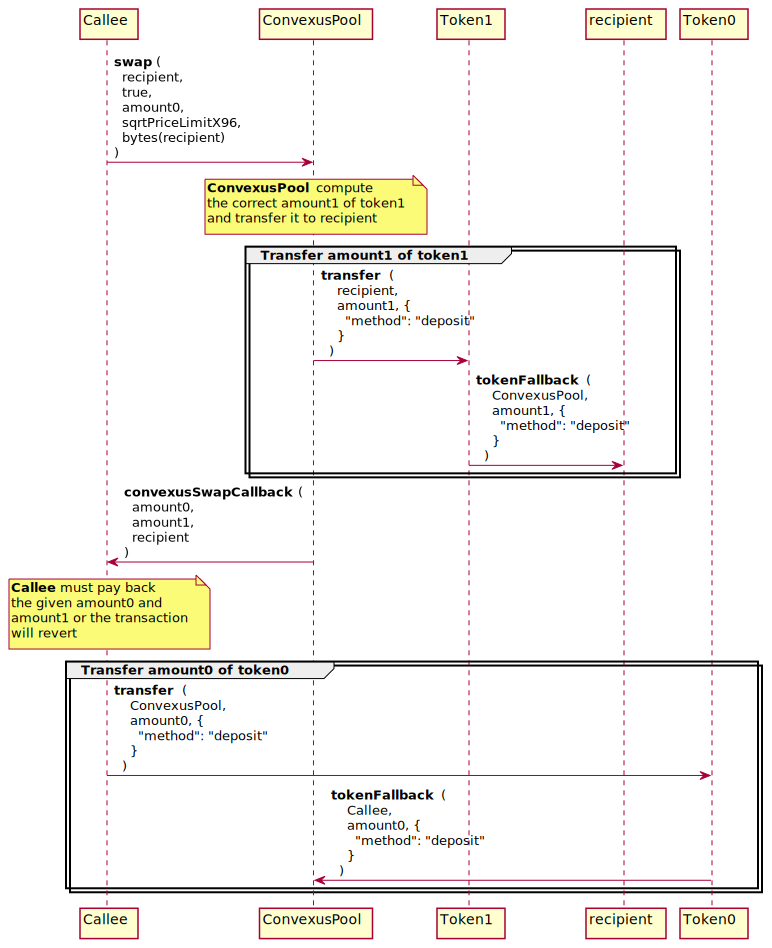

# 📖 Introduction

A Convexus Pool is able to swap two tokens by calling its [`swap`](#swap) method. For doing so, it needs an amount of token to be swapped and a minimum price, so the user doesn't end with less tokens than expected.

The [`swap`](#swap) method must **not** be called directly from a EOA address. Another contract outside of the Core Layer should handle the user tokens during the swap. Consequently, only another SCORE contract can deposit tokens to a Convexus Pool contract, otherwise the transaction will be reverted. In most use cases, the [SwapRouter](/periphery-layer/swaprouter/index.md) contract may handle the swap.

Below is the entire process flow for swapping a fixed amount of `token0` to a Convexus Pool from a generic `Callee` contract.

> 📝 Note
> 
> The methods implemented in the generic `Callee` contract isn't part of the Core layer, its implementation may be customized depending of your needs. In most cases, a `SwapRouter` is used for performing the swaps. See the [SwapRouter documentation](/periphery-layer/swaprouter/index.md) for more information.



# 📜 Write Methods

## `swap`

- 📚 Description: 
  - Swap `token0` for `token1`, or `token1` for `token0`
  - The caller of this method receives a callback in the form of [`convexusSwapCallback`](#convexusswapcallback) and must call it correctly. If the caller doesn't implement this method or doesn't fulfill the swap conditions, the call will fail. See the [`convexusSwapCallback`](#convexusswapcallback) documentation for more information.
- 🔒 Access:
  - Everyone (must be a contract, EOA will fail)
- 🔎 Event Logs emitted:
  -  [`Swap`](#swap-1p)

### 🖊️ Signature

```java
@External
public PairAmounts swap (
    Address recipient,
    boolean zeroForOne,
    BigInteger amountSpecified,
    BigInteger sqrtPriceLimitX96,
    byte[] data
)
```

- `recipient`: The address to receive the output of the swap
- `zeroForOne`: The direction of the swap, true for token0 to token1, false for token1 to token0
- `amountSpecified`: The amount of the swap, which implicitly configures the swap as exact input (positive), or exact output (negative)
- `sqrtPriceLimitX96`: The [Q64.96](/commons/q6496.md) price limit. If zero for one, the price cannot be less than this
- `data`: Any data to be passed through to the callback
- Returns: Amount of `token0` and `token1` swapped

### 🧪 Example call

```java
{
  "to": ConvexusPool,
  "method": "swap",
  "params": {
    "recipient": EOA,
    "zeroForOne": "0x1", // token0 -> token1
    "amountSpecified": "0xde0b6b3a7640000", // 10**18
    "sqrtPriceLimitX96": "0xb504f333f9de6484597d89b3", // encodePriceSqrt(1, 2)
    "data": bytes(EOA) // may be anything useful in convexusSwapCallback
  },
}
```

## `convexusSwapCallback`

- 📚 Description: 
  - A callback called by a Convexus Pool to the contract performing the swap. 
  - **You should implement this method in your contract** if you perform a swap with a Convexus Pool.
  - After calling the `swap` method, the Convexus Pool will send the computed amount of tokens to the recipient address through the `convexusSwapCallback` method. After calling the callback, the Pool will be waiting for the correct amount of input tokens owed to the Pool.
  - In the `convexusSwapCallback` implementation, you must pay the pool tokens owed for the swap, or the transaction will revert.
  - For security purposes, the caller of this method should be checked to be a `Convexus Pool` deployed by the canonical [`Convexus Pool Factory`](/core-layer/factory/index.md). See `CallbackValidation::verifyCallback` for more information.
  - `amount0Delta` and `amount1Delta` can both be 0 if no tokens were swapped.
- 🔒 Access: 
  - Everyone (must be a contract, EOA will fail)

### 🖊️ Signature

```java
@External
public void convexusSwapCallback (
    BigInteger amount0Delta,
    BigInteger amount1Delta,
    byte[] data
)
```

- `amount0Delta`: The amount of token0 that was sent (negative) or must be received (positive) by the pool by the end of the swap. If positive, the callback must send that amount of token0 to the pool.
- `amount1Delta`: The amount of token1 that was sent (negative) or must be received (positive) by the pool by the end of the swap. If positive, the callback must send that amount of token1 to the pool.
- `data`: Any data passed through by the caller via the swap call

### 🧪 Example call

```java
{
  "to": Callee,
  "method": "convexusSwapCallback",
  "params": {
    "amount0Delta": "0x1000", // needs to be paid to the pool
    "amount1Delta": "0x0",
    "data": [...] // same value than the `swap` data field
  },
}
```

# 🔎 Event Logs

## `Swap`

- Emitted by the pool for any swaps between `token0` and `token1`

```java
@EventLog(indexed = 2)
protected void Swap (
    Address sender,
    Address recipient,
    BigInteger amount0,
    BigInteger amount1,
    BigInteger sqrtPriceX96,
    BigInteger liquidity,
    int tick
)
```

- `sender`: The address that initiated the swap call, and that received the callback
- `recipient`: The address that received the output of the swap
- `amount0`: The delta of the token0 balance of the pool
- `amount1`: The delta of the token1 balance of the pool
- `sqrtPriceX96`: The sqrt(price) of the pool after the swap, as a [Q64.96](/commons/q6496.md)
- `liquidity`: The liquidity of the pool after the swap
- `tick`: The log base 1.0001 of price of the pool after the swap

