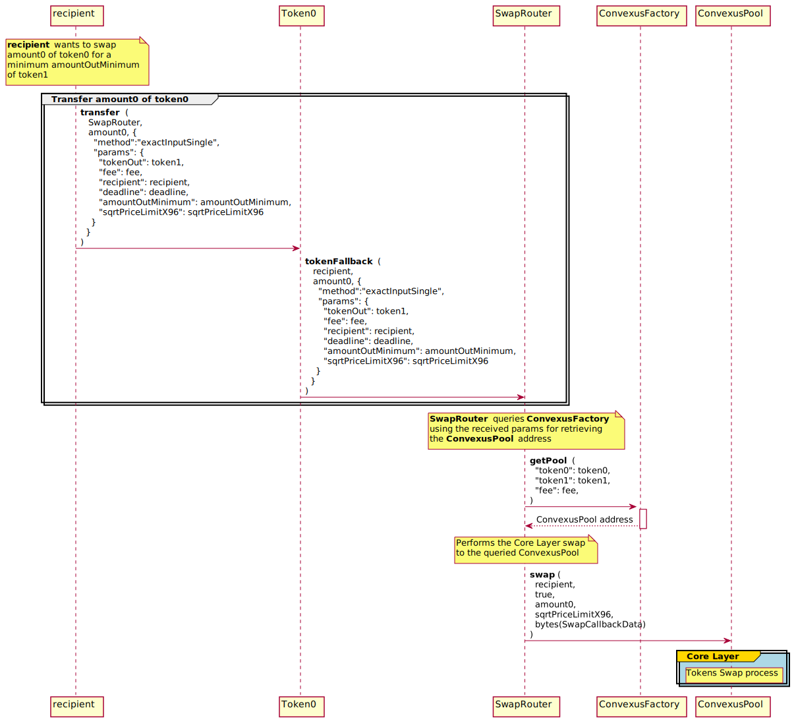

# 📖 Introduction

The `SwapRouter` is the contract doing all verifications in terms of amounts or slippage and handle the swap callback which is responsible to verify the authenticity of the pool. The SwapRouter can manage multiroute swaps.

# **Single & Multihops Swaps**

The `SwapRouter` is able to swap two tokens thanks to the [ConvexusPool `swap`](/core-layer/pool/swap.md#swap) method. It supports multiple ways of swapping tokens, depending of the user needs:

- [`exactInputSingle`](single-swap/exact-input.md#exactinputsingle): Swaps `amountIn` of one token for as much as possible of another token
- [`exactInput`](multihop-swap/exact-input.md#exactinput): Swaps `amountIn` of one token for as much as possible of another along the specified path
- [`exactOutputSingle`](single-swap/exact-output.md#exactoutputsingle): Swaps as little as possible of one token for `amountOut` of another token
- [`exactOutput`](multihop-swap/exact-output.md#exactoutput): Swaps as little as possible of one token for `amountOut` of another along the specified path (reversed)

Below is the entire process flow for swapping a fixed amount of `token0` to a Convexus Pool, using the `exactInputSingle` method from a Convexus Swap Router. The process flow is the same for `exactInput`, `exactOutputSingle` and `exactOutput`.

> 📝 Note
> 
> If you need more detailed information about the token swap process in the core layer, see [here](/core-layer/pool/swap.md#📖-introduction).

